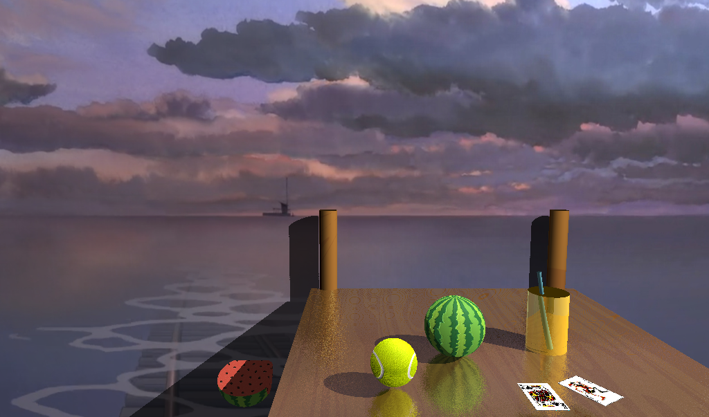

# Ray tracer

---

## Dependencies
* OpenGL 3.2+
* GLFW
    * http://www.glfw.org/
* Lua
    * http://www.lua.org/
* Premake4
    * https://github.com/premake/premake-4.x/wiki
    * http://premake.github.io/download.html
* GLM
    * http://glm.g-truc.net/0.9.7/index.html
* ImGui
    * https://github.com/ocornut/imgui

---

## Building Projects
We use **premake4** as our cross-platform build system. First you will need to build all
the static libraries that the projects depend on. To build the libraries, open up a
terminal, and **cd** to the top level of the CS488 project directory and then run the
following:

    $ premake4 gmake
    $ make

This will build the following static libraries, and place them in the top level **lib**
folder of your cs488 project directory.
* libcs488-framework.a
* libglfw3.a
* libimgui.a

## Purposes
Render picture containing different kinds of objects including primitives I implemented with features such as the Refraction and CSG.

## Introduction Statement
Some of the objectives can be implemented with the same technique. 
For instance, Anti-aliasing, soft shadow as well as depths of field can be implemented using super-sampling. 
Bump mapping is implemented based on texture mapping; it’s still using the kd value generated by uv interpolation from texture mapping. Moreover, it adds the bumps by changing the normal vector. 
The rather challenging part of the project id Refraction and CSG. 
For Refraction you need to take both reflection and refraction into consideration. 
And CSG need to trace t during the entire process for the 2 interactive objects. 
Based on these objectives, I made a final scene that combines some of these features.

## Images
all images rendered by this ray_tracer are in images_done

